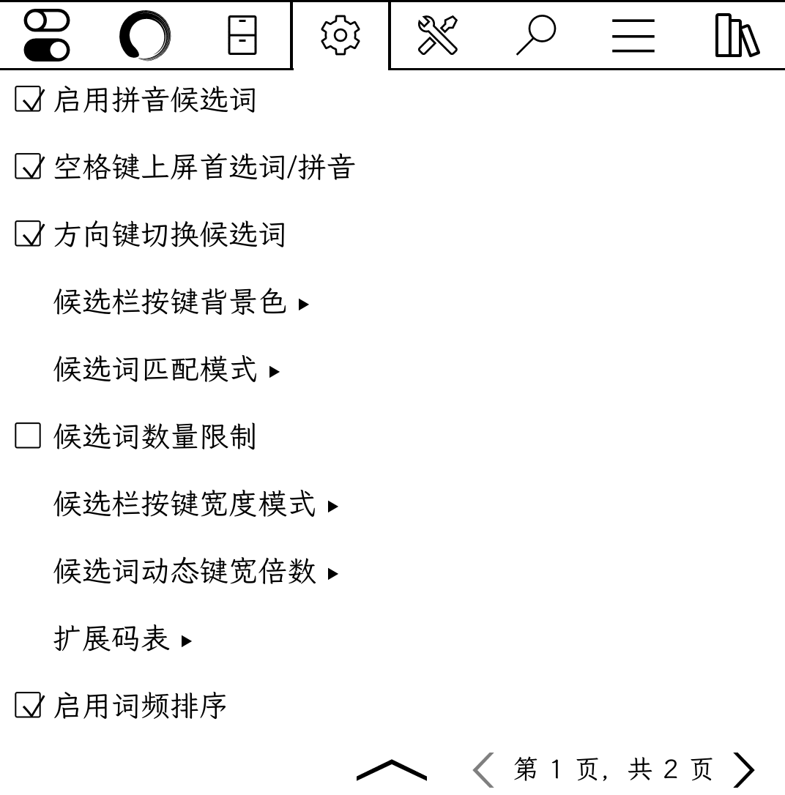
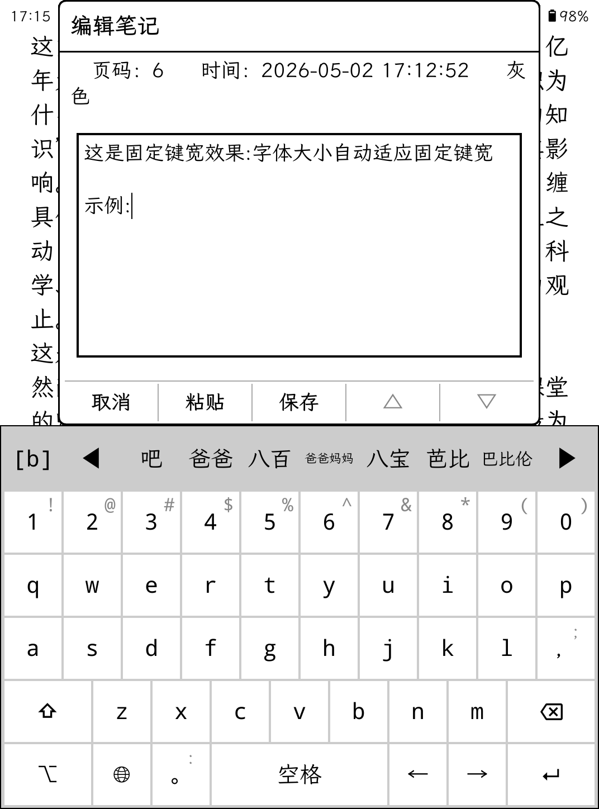
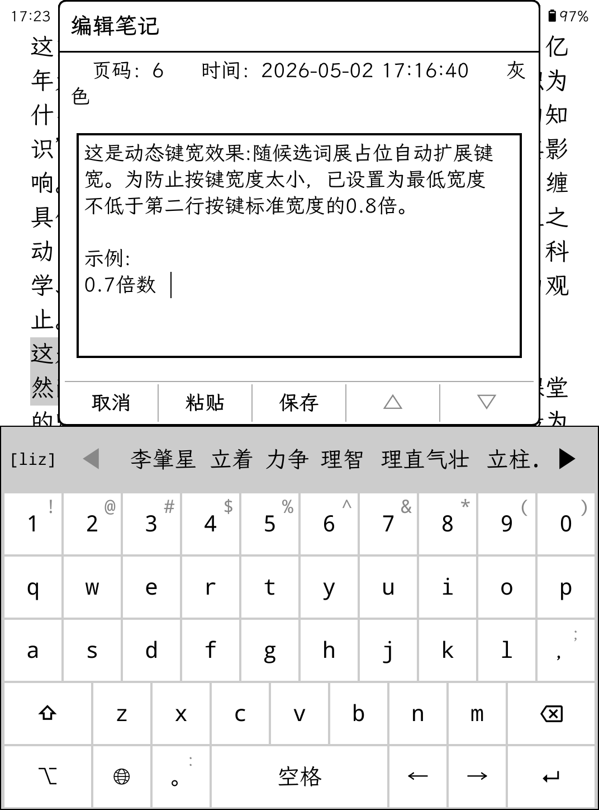
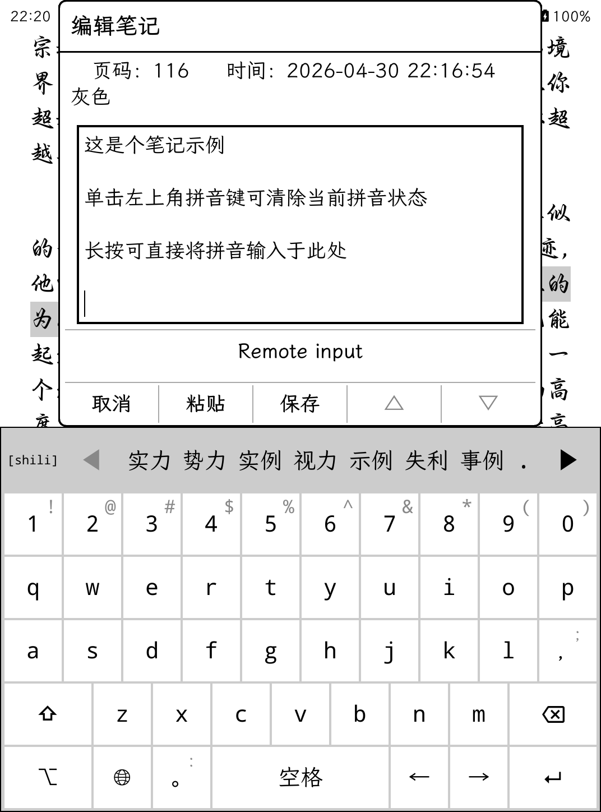
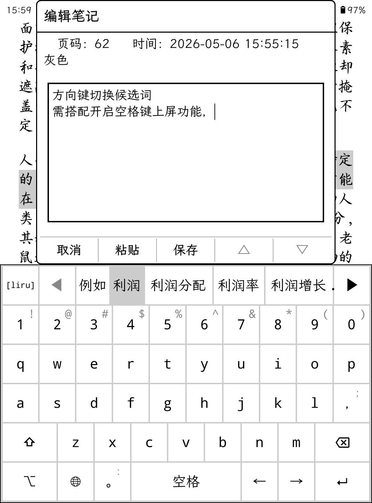
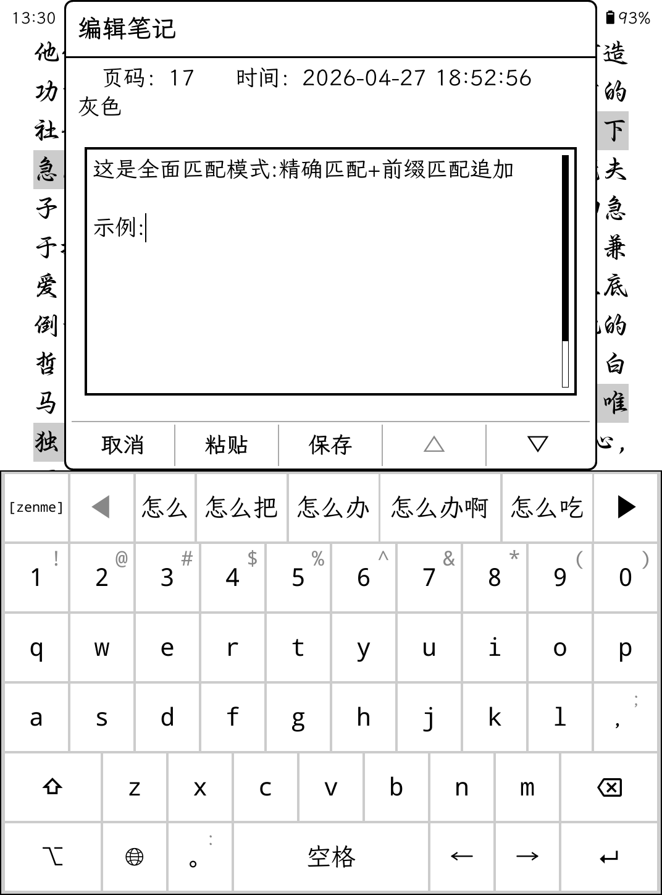

# pinyin_enhancement.koplugin

#### Description

KOReader plugin - Pinyin input method enhancement: displays a candidate word bar above the pinyin input method, tap to input Chinese characters.

#### Installation Instructions

After downloading and extracting, place the `pinyin_enhancement.koplugin` folder into the `koreader\plugins` directory.

#### Usage Instructions

1. [Settings] - [Pinyin Input Method Enhancement] - Enable Pinyin candidate words (enabled by default, can be disabled, supports shortcut gestures).
2. The Pinyin key on the left side of the candidate bar displays the user's current Pinyin input in real time:

   - **Tap**: Directly input the Pinyin and clear the candidate bar state
   - **Long press**: Clear the current Pinyin state

3. Menu Configuration Items:

| Configuration Item | Description |
|--------------------|-------------|
| Space to confirm| Tap Space to confirm primary candidate (or Pinyin if no candidate, or space if neither); Long press to confirm Pinyin |
| Enter to confirm| Tap Enter to confirm Pinyin (or line break if no Pinyin); Long press to confirm candidate |
| Navigate candidates with arrow keys | Use arrow keys to switch candidates, Space/Enter to confirm (requires enabling Space/Enter confirmation feature) |
| Candidate bar key background color | Options: White, Light gray |
| Candidate matching mode | **Precise mode** (stop on match); **Comprehensive mode** (match and append) - displays both exact and prefix match results together |
| Candidate word limit | Default 56 candidates, can be disabled (may affect performance) |
| Candidate key width mode | **Dynamic width** (fixed text size); **Fixed width** (text automatically shrinks) |
| Candidate dynamic width multiplier | 6 options from 0.5x to 1.0x (minimum width ≥ 0.8× width of a single key in the second row) |
| **⚠️ Extended Lexicons** | Enable to load extended lexicons. **⚠️ WARNING: Loading a large number of lexicons will consume significant memory and may cause the device to freeze due to insufficient memory. Please be sure to back up the complete `koreader` folder before enabling!** |
| Enable frequency sort | When enabled, candidate words are sorted by usage frequency (most used first). Words with the same frequency keep their original order |
| Clear candidate word history | Clear history to restore original candidate order |

4. Candidate Word Sources:
   - KOReader source table: `ui/data/keyboardlayouts/zh_pinyin_data.lua`
   - Initial Pinyin lexicon: `zh_pinyin_data_abbr.lua`
   - Extended lexicons: `lexicon`

#### Initial Pinyin Lexicon Description

- Generated from KOReader source `ui/data/keyboardlayouts/zh_pinyin_data.lua`
- Generation tool: `Node.js`
- Helper module: [pinyin-pro](https://github.com/zh-lx/pinyin-pro)
- Format: `["aa"]={"aah"}` (English example) or `["bb"]={"dad","eight hundred"}`
- You can add mappings in the same format, or replace the entire lexicon content

#### Extra Lexicons Description

- Vocabulary source: `https://pinyin.sogou.com/dict/`
- Conversion tool: `node.js` (converts `scel` format to koreader standard `lua` format)
- Custom lexicons: If you need to add a custom lexicon, simply place your self-made lexicon file (ensure correct format) into the `lexicon` folder. The plugin will automatically scan all lexicons in this folder and display them in the `Extended Lexicons` menu. Find the lexicon in the menu and enable it.

- **⚠️ WARNING: Loading a large number of lexicons will consume significant memory and may cause the device to freeze due to insufficient memory. Please be sure to back up the complete `koreader` folder before enabling!**
- **⚠️ WARNING: Custom user-added lexicons must not be too large (exceeding 1MB), as they may also cause the device to freeze due to insufficient memory. Please be sure to back up the complete koreader folder before enablin!**

| Filename | Menu Display Name | Type |
|----------|-------------------|------|
| `Classical Poetry.lua` | 古诗词码表 | File |
| `Finance.lua` | 财经金融码表 | File |
| `Ideological.lua` | 思政专业术语码表 | File |
| `Idiom` | 成语俗语码表 | Folder |
| `Legal.lua` | 法律码表 | File |
| `Neologisms.lua` | 新词集锦码表 | File |
| `Three-Character Idiom.lua` | 三字成语码表 | File |
| `WittySaying.lua` | 歇后语码表 | File |

#### Contributing

1. Fork this repository
2. Create a new Feat_xxx branch
3. Commit your code
4. Create a new Pull Request

#### Repository Links

- Gitee : https://gitee.com/gytwo/pinyin_enhancement.koplugin
- GitHub: https://github.com/gytwo/pinyin_enhancement.koplugin