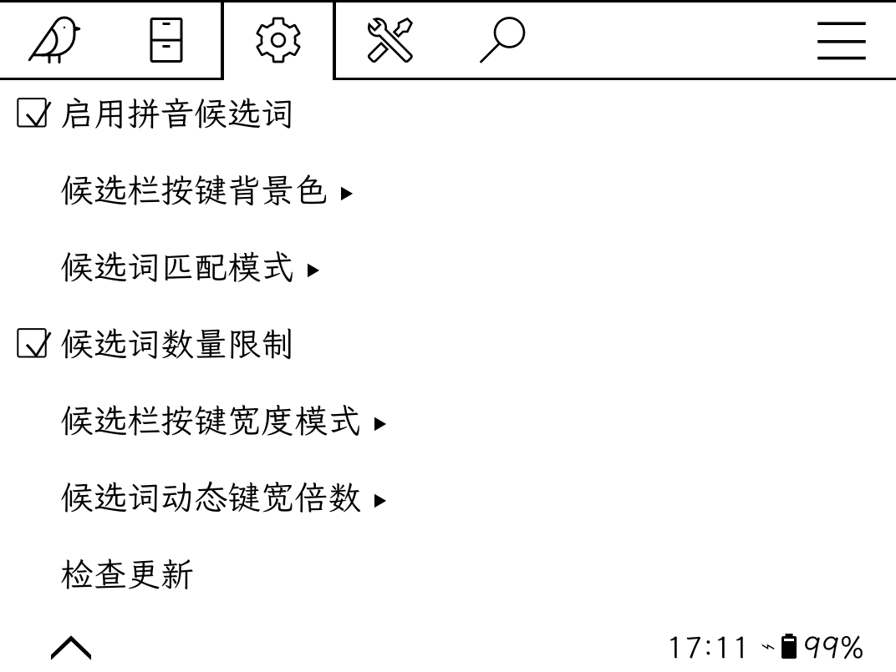
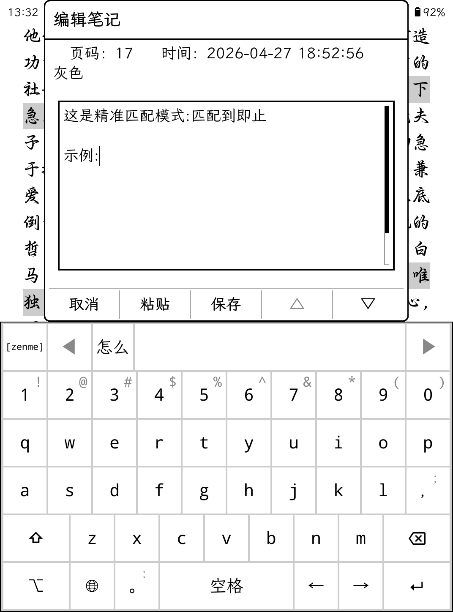

# pinyin_enhancement.koplugin

#### 介绍
koreader插件-拼音输入法增强：在拼音输入法上方显示候选词栏，点击即可输入汉字

#### 安装教程

下载解压后将pinyin_enhancement.koplugin文件夹放到koreader\plugins目录下

#### 使用说明

1.  [设置]-[拼音输入法增强]-选择启用拼音候选词（默认启用状态，可选择关闭，可设置快捷手势操作）
2.  候选栏左侧拼音按键会实时显示用户输入的拼音，单击该按键可一键清空当前拼音状态，长按该按键则直接输入拼音并清空候选栏状态
3.  菜单配置项目  
-    候选栏按键颜色：白色、浅灰色（与键盘背景色融为一体）
-    候选词匹配模式：精准模式（匹配到即止）、全面模式（匹配追加）。选择候选词的匹配方式。默认为按照精确匹配-前缀匹配的优先级别进行查找，若精确匹配查找不到，仍旧会进行前缀匹配。若精确匹配已找到，则停止匹配。若要同时显示精确匹配及前缀匹配的结果，需要开启全面模式-匹配追加
-    候选词数量限制：默认56个候选词，可取消限制，但可能会影响性能速度。
-    候选词按键宽度模式：动态键宽（文字大小固定）、固定键宽（文字自动缩小））  
-    候选词动态键宽倍数：0.5-1共6个可选项，用于调整候选词的按键宽度（最低不小于第二行单个按键宽度的0.8倍）  
4.  候选词来自koreader源码表ui/data/keyboardlayouts/zh_pinyin_data，理论上可以通过置换源码表（即添加首字母映射）实现首字母拼音模式

